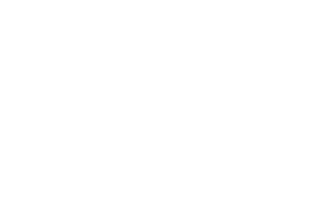

<h1>The Perceptron Unit</h1>

    This is a perceptron unit with training algorithm written in C++

<h1>Mathematical Model</h1>

    This perceptron uses a step function (1), where τ is called the threshold, to classify linearly seperable data or make simple decisions.
    The function can be rewritten so that the inequalities are set to zero (2), where the bias b = -τ.

    

    

    

    The function is hiding some important details. 
    The input for the perceptron is a weighted sum, which is given by the dot product of two vectors.
    Let x be an inpute vector and ω a network vector, each having n components (3).
    The input vector contains the data to be interpreted by the perceptron.
    The network vector contains the weight or coefficient for each input vector component.

    To make things more compact, we can increase the size of both vectors to n + 1, 
    force the first component of the input vector to be -1
    and force the first component of the network vector to be the threshold τ,
    so that the first product in the sum is -τ.
    Alternatively, we can force the first component of the input vector to be 1
    and the first component of the network vector to be the bias b (4).

<h1>The Perceptron Training Algorithm and Classification</h1>

    The perceptron training algorithm enables the perceptron to compute the correct network, or vector of weights, given a training sample of data,
    which contains input vectors and their expected outputs or target values.
    If a large enough representative sample of input vectors are in the training data set,
    the network weights computed by the training algorithm can then be used to classify all the data from which the training set was sampled,
    as long as the data is linearly separable.

    The condition that the data must be linearly separable comes from the mathematical model of the perceptron.
    In 2 dimensions, given an input vector ( 1, x, y ) and a network vector ( b, ω1, ω2 ), the dot product is b + ω1x + ω2y.
    Replacing the inequalities with an equals sign and solving for y creates a line (5).

        Therefore, the perceptron can only classify data that can be separated by this line.
        This is also true for n dimensions in which the line is a hyperplane.

    The training algorithm is as follows:

    This algorithm is slighly different than other perceptron learning algorithms in that the output vector
    is conditioned to exactly equal the target vector before stopping the loop.
    This is always possible with the appropriate weights, as long as the data is linearly separable.
    If the data is not linearly separable, an infinite loop may ensue.

    To demonstrate, the "train_and_test.cpp" module can be run to train and test the perceptron to classify clusters in the Iris flower data set.
    The data set contains measurements of iris flowers of three different species in centimeters.
    The module trains the perceptron to differentiate between the iris setosa and the others (iris virginica and iris versicolor)
    from sepal and petal length measurements. The training process was performed on the complete data set and shown below.
    The aforementioned line is updated with the updated weights each time the for loop completes.
    The algorithm goes through the data multiple times. The line stops updating when the output equals the target values.
    After the training algorithm completes, everything to the left of the line gives an output of 1, and everything to the right gives an output of 0.

    The idea is that the final weights used to construct the line that separates the iris setosa species from the others
    can now be applied to a new sepal and petal length measurement of an unknown iris species to classify it.

